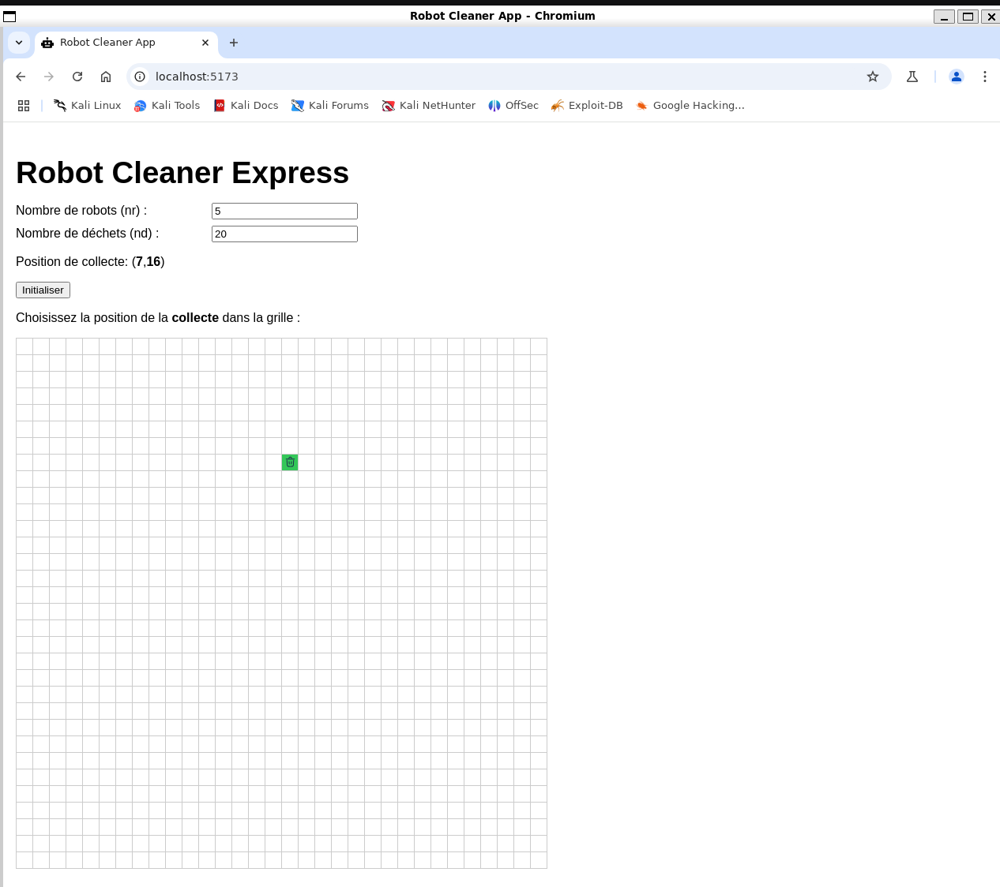
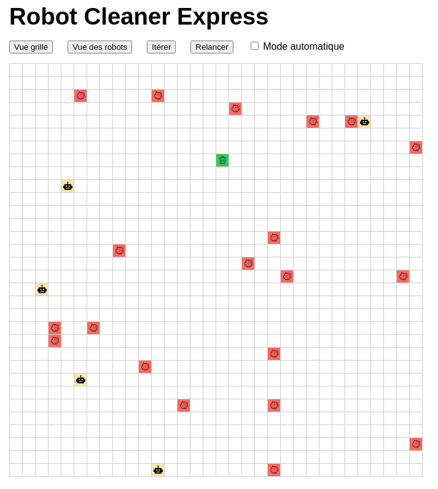
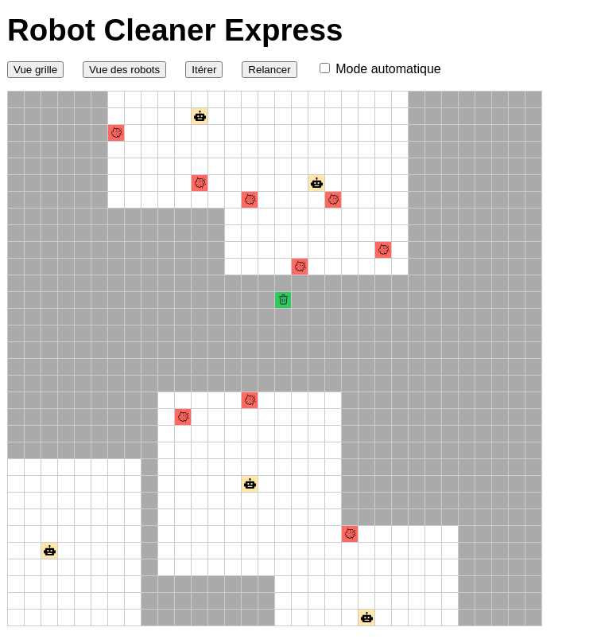
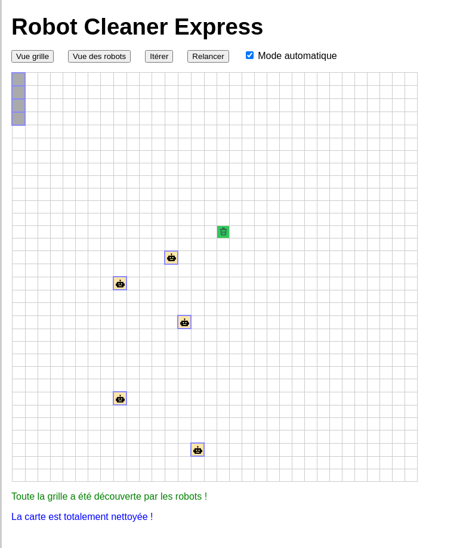
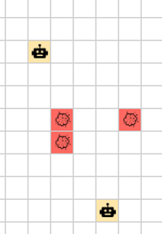
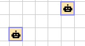

# robotclean
Robot clean

# Pour lancer l'application
## backend
``` 
python3 -m venv venv
source venv/bin/activate
pip install django djangorestframework
pip install django-cors-headers 
cd robotclean
``` 
puis : 
 	``` 
./run.sh
 	``` 
## frontend
``` 
sudo apt install npm
cd robot-frontend
puis : ./run.sh
``` 

## Screen capture


Setup initial, paramétrage



Vue de la grille complete



Vue des robots : carte découverte 5 cases autour



Fin quand plus de déchet ni rien à découvrir

## videos

[Accéder au dossier des vidéos](./assets/videos)

# Creation du projet

## backend
``` 
python3 -m venv venv
source venv/bin/activate
pip install django djangorestframework
``` 
### eviter des erreurs cross origin CORS

``` 
pip install django-cors-headers 
``` 
### create project
``` 
django-admin startproject robotclean
cd robotclean
``` 
### create app backend
``` 
python manage.py startapp robotbackend
``` 
### add app to project
``` 
	nano robotclean/settings.py
``` 
``` 
INSTALLED_APPS = [
    "corsheaders",
    "rest_framework",
    "robotbackend"
``` 
	
* create urls.py in project and robotbackend app
* create views.py in app robotbackend


## FRONT en react.js
``` 
sudo apt install npm
npm create vite@latest robot-frontend -- --template react-ts
cd robot-frontend
``` 

# algorithme
## vision
On dispose de la grille initiale mais les robots ont leur propre grille qui correspond aux zones découverts à 5 case d'un robot existant


Les robots ont la même grille partagée et gardent en mémoire les zones déjà connues


## Affectés / disponibles
Les robots et les déchets sont par défaut disponibles (il n'ont pas de cadre autour).



Une fois 'affectés' voir ci après ils sont encadrés par une bordure bleue autour de leur picto.



## Affectation
La priorité est le ramassage des déchéts, pour cela le programe va :

1) mettre la jour la carte connue des robots (celle déjà connue + les cases à 5 de distance de chaque robot)

2) dans la carte découverte uniquement recherche si il existe des déchets non affectés, 

3) Pour chaque déchet non affecté, recherche du robot <strong>non affecté</strong> le plus proche. Ceux ayant déjà une activité sont ignortés même si exploration (optimisation future possible de gérer une affectation prioritaire)

Si il existe un couple (déchet , robot) non affecté : le déchet et le robot sont marqués affectés et le robot à pour destinatuion le déchet. Le déchet n'est plus disponbible pour un autre robot

4) Si il reste des robots non affectés et des zones non découvertes, le robot est affecté à la case de la zone découverte la plus proche (cela devient sa destination). 

5) un robot affecté à un déchet et l'atteignant va retirer le déchet de la grillle (chargé sur le robot) et pernd pour destination la corbeille (il reste affecté jusq'à la corbeille).

6) un robot avec un déchet en destination de la corbeille redevient disponbible à son contact : si il peut atteindre la case il libère le déchet et est disponible

7) si plus aucune case à découvrir ni plus aucun déchet non affecté le robot reste définitivement sans affectation. Toutefois : voir "collisions" ci après il n'est pas "immobile" pou ne pas créer de mur de robots non affectés. Il se déplace aléatoirement vers une destination

## Déplacement
Chaque robot qui a une destination (et ne l'a pas atteinte) va se déplacer : 

pour cela il fait un 'pas' sur l'axe i ou j mais pas les deux (pas de diagonale).

Il prend par défaut la direction ou ila le plus de distance à faire sauf collision


## Collision
Un robot qui doit se déplacer sur une case ne peut y aller si elle est occupée par un autre robot : soir ca run autre vient de se déplacer vers cete case , soit si ile ne la quite pas pour un autre 

Si le robot avait "prévu" de déplacer sur l'axe i, il tente le déplacement sur l'axe j si déplacement en j résiduel (et inversement)

Si le robot est toujours coincé (case invalide car encore occupée ou sur un bord) : il va aléatoirement se déplacer sur un autre axe même si cela ne le rapproche pas de la destination (éviter l'effet de 'mur' de robots immobiles). A la prochaine itération il reprend sa route 

## FIN
Les tours prennent fin si aucun déchet ne reste ET QUE aucune case ne reste à découvrir car il pourrait y avoir un déchet.


# Amélioration possibles
* ajout d'obstacles (ex picto arbre qui sont des case interdites pour toute la partie)
* gestion d'un sessionID permettant des parties multijoueur sur le serveur
* meilleure gestion des robots et des affectations (objets) permettant des affectatiobs prioritaires; A ce jour les grilles ne sont que des atrices avec un code sur la case
*  algorithme d'évitement et de destination plus fin (pas en random)
* ...
